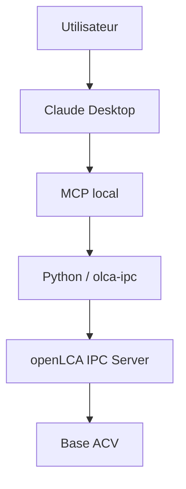

# Architecture cible

## Responsabilités

### Claude Desktop

Reçoit la demande en langage naturel, orchestre les appels autorisés et présente la réponse. Il ne produit pas lui-même les résultats ACV.

### Serveur MCP

Expose à Claude un ensemble minimal d'outils locaux, contrôlés et auditables. Le MCP traduit les intentions en opérations techniques, mais **ne doit pas devenir un moteur ACV**.

### Couche Python

Valide les entrées, appelle les fonctions nécessaires et transforme les réponses techniques en structures exploitables. Elle accueillera ultérieurement les scripts et tests, sans logique de calcul ACV concurrente à openLCA.

### `olca-ipc`

Bibliothèque cliente Python prévue pour communiquer avec l'interface IPC d'openLCA.

### Serveur IPC openLCA

Point d'entrée local d'openLCA. Il reçoit les requêtes de la couche Python et délègue les opérations au moteur openLCA.

### Base ACV

Contient les processus, flux, méthodes et autres données nécessaires. Elle reste locale lorsqu'elle est volumineuse, sensible, propriétaire ou soumise à licence.

## État d'implémentation

Ce schéma décrit une cible. Aucun serveur MCP, client IPC ou calcul openLCA n'est implémenté dans le lot initial.
